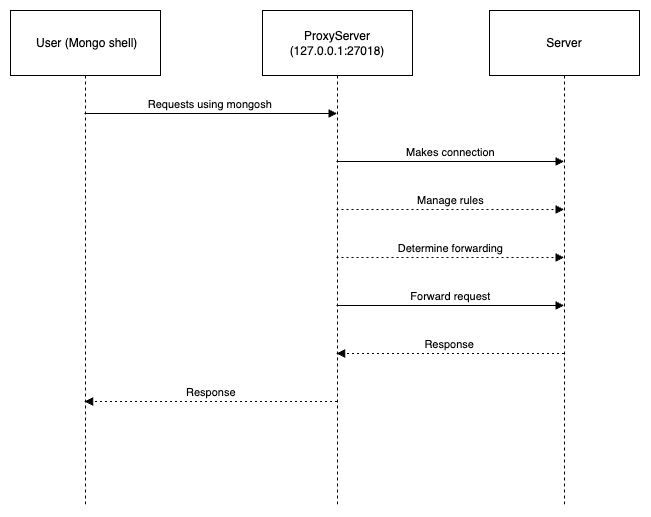

# MongoDB Proxy ABAC Server

This repository contains the implementation of a Proxy ABAC (Attribute-Based Access Control) server for MongoDB. This server acts as an intermediary between client applications and MongoDB database, enforcing access control policies based on user, object and env attributes.

## Features

- **Proxy Server**: Acts as a proxy between client applications and MongoDB, intercepting and processing requests.
- **Attribute-Based Access Control (ABAC)**: Implements ABAC policies to control access to MongoDB resources based on user, object and env attributes such as role, department, or location.
- **Integration with MongoDB**: Utilizes MongoDB database to store and manage access control rules, providing flexibility and scalability.
- **Latest Wire Message Protocols**: Implements the latest wire message protocols for efficient communication between the proxy server and MongoDB.
- **Rule Management System**: Provides functionalities to create, update, and delete access control rules dynamically through the MongoDB database.
- **Asynchronous I/O**: Utilizes asynchronous I/O operations for improved performance and scalability.

## Installation

1. Clone the repository:

    ```bash
    git clone https://github.com/kamal7643/MongoDB-Proxy-ABAC.git
    ```

2. Install dependencies:

    ```bash
    pip install virtualenv
    virtualenv venv
    source venv/bin/activate
    pip install -r requirements.txt
    ```

## Usage

1. Start the MongoDB server 
    ```bash
    mongod
    ```

2. Start the MongoDB Proxy ABAC Server:

    ```bash
    python main.py
    ```
3. Start mongosh shell
    ```bash
    mongosh --port 27018
    ```
## Proxy Server Workflow



## Development machine configuration
Python 3.9.6
macos